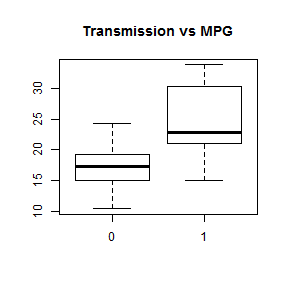
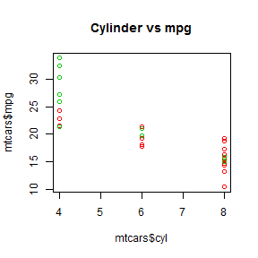

## Question

<h3>Is there any relation between MPG and the transmisson mode of the cars</h3>

<p>1. Is there any relationship?</p>
<p>2. Is there any influence of number of cylinders?</p>

--- .class #id 

## Data


In this example i will use the "MTCARS" dataset, it contains 32 observations:

```r
head(mtcars)
```

```
##                    mpg cyl disp  hp drat    wt  qsec vs am gear carb
## Mazda RX4         21.0   6  160 110 3.90 2.620 16.46  0  1    4    4
## Mazda RX4 Wag     21.0   6  160 110 3.90 2.875 17.02  0  1    4    4
## Datsun 710        22.8   4  108  93 3.85 2.320 18.61  1  1    4    1
## Hornet 4 Drive    21.4   6  258 110 3.08 3.215 19.44  1  0    3    1
## Hornet Sportabout 18.7   8  360 175 3.15 3.440 17.02  0  0    3    2
## Valiant           18.1   6  225 105 2.76 3.460 20.22  1  0    3    1
```


--- .class #id 

## Exploratory

First of all i inspect the data with some plots



--- .class #id 

## Model

<h3>The final model:</h3>

```
## 
## Call:
## lm(formula = mtcars$mpg ~ mtcars$am + mtcars$cyl)
## 
## Residuals:
##    Min     1Q Median     3Q    Max 
## -5.686 -1.717 -0.266  1.884  6.814 
## 
## Coefficients:
##             Estimate Std. Error t value Pr(>|t|)    
## (Intercept)   34.522      2.603   13.26  7.7e-14 ***
## mtcars$am      2.567      1.291    1.99    0.056 .  
## mtcars$cyl    -2.501      0.361   -6.93  1.3e-07 ***
## ---
## Signif. codes:  0 '***' 0.001 '**' 0.01 '*' 0.05 '.' 0.1 ' ' 1
## 
## Residual standard error: 3.06 on 29 degrees of freedom
## Multiple R-squared:  0.759,	Adjusted R-squared:  0.742 
## F-statistic: 45.7 on 2 and 29 DF,  p-value: 1.09e-09
```

